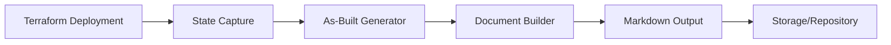

# As-Built Documentation Generator

## Overview

An automated application that generates comprehensive as-built documentation after Terraform deployments complete, capturing the actual deployed infrastructure state and configuration.

## Architecture

### Components



### Core Modules

1. **State Analyzer**: Parses `terraform.tfstate` and extracts deployed resources
2. **Resource Documenter**: Generates detailed documentation per resource type
3. **Diagram Generator**: Creates architecture diagrams from state
4. **Markdown Builder**: Compiles comprehensive as-built document
5. **Metadata Collector**: Captures deployment metadata (timestamp, user, version)

## Implementation Options

### Option 1: Post-Deployment Script

```bash
#!/bin/bash
# Run after terraform apply
terraform show -json > state.json
./asbuilt-generator --state state.json --output docs/asbuilt-$(date +%Y%m%d).md
```

### Option 2: Terraform Output Integration

```hcl
output "asbuilt_data" {
  value = {
  resources = [for k, v in module.infrastructure : {
    type = v.type
    name = v.name
    properties = v.attributes
  }]
  }
}
```

### Option 3: Azure DevOps/GitHub Actions Pipeline

```yaml
- name: Generate As-Built Documentation
  run: |
  terraform show -json | asbuilt-generator > asbuilt.md
  git add asbuilt.md
  git commit -m "docs: update as-built documentation"
```

## Document Structure

```markdown
# As-Built Documentation - [Deployment Name]

## Deployment Metadata
- Date: YYYY-MM-DD HH:MM:SS
- Terraform Version: X.Y.Z
- AzureRM Provider Version: X.Y.Z
- Deployed By: [User/Pipeline]

## Resource Inventory
### Resource Groups
### Networking
### Compute
### Storage
### Security

## Configuration Details
[Per-resource configuration]

## Architecture Diagram
[Auto-generated diagram]

## AVM Modules Used
[List of AVM modules with versions]
```

## Key Features

- ✅ Automatic state file parsing
- ✅ AVM module version tracking
- ✅ Resource relationship mapping
- ✅ Configuration drift detection
- ✅ Compliance validation results
- ✅ Cost estimation capture
- ✅ Architecture diagram generation
- ✅ Version-controlled documentation

## Integration Points

- Post `terraform apply` hook
- CI/CD pipeline stage
- Azure DevOps release gate
- GitHub Actions workflow
- Git commit automation

## Tools & Technologies

- **Parser**: `jq` or Python for JSON state parsing
- **Diagrams**: `terraform-graph`, `graphviz`, or `mermaid`
- **Templates**: Jinja2 or Go templates
- **Storage**: Git repository, Azure Blob, or Wiki
